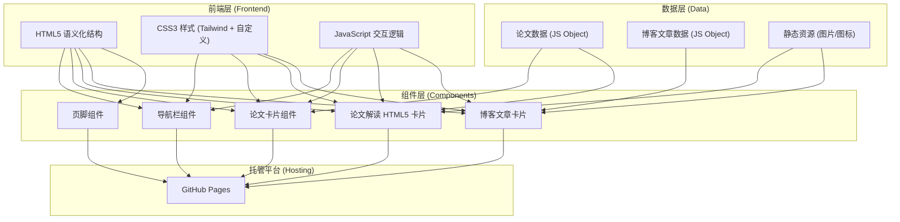

## 1. 架构设计

GitHub Pages 纯静态网站架构，无后端依赖，完全通过前端技术实现交互效果。



## 2. 技术说明
- **前端**：纯 HTML5 + CSS3 + 原生 JavaScript（无需构建工具，直接部署到 GitHub Pages）
- **CSS 框架**：Tailwind CSS v3（通过 CDN 引入，无需本地构建）
- **图标库**：Lucide Icons（CDN 引入）
- **字体**：Google Fonts（Playfair Display + Inter）
- **图表展示**：纯 HTML/CSS 实现论文图表裁剪展示，原生实现图片查看器
- **后端**：无（纯静态网站）
- **数据库**：无（数据使用 JavaScript 对象硬编码，便于后续扩展）
- **部署**：直接推送到 GitHub 仓库的 main 分支，GitHub Pages 自动部署

选择纯 HTML/CSS/JS 方案而非 React 的原因：
1. GitHub Pages 原生支持静态 HTML，无需构建流程
2. 零依赖，打开即运行，维护简单
3. 加载速度快，SEO 友好
4. 对于个人博客完全足够，后续可平滑迁移到框架

## 3. 路由定义
| 路径 | 用途 |
|-----|------|
| /francis.github.io/index.html | 首页（英雄区 + 精选论文 + 最新博客） |
| /francis.github.io/papers.html | 论文解读列表页 |
| /francis.github.io/paper-detail.html | 单篇论文详情（HTML5 卡片解读） |
| /francis.github.io/blog.html | 博客文章列表页 |
| /francis.github.io/about.html | 关于我页面 |

注：路径包含 /francis.github.io/ 前缀，因为当前仓库名为 francis.github.io 而非 larry919.github.io。如果后续重命名仓库，路径可简化。

## 4. 目录结构
```
francis.github.io/
├── index.html              # 首页
├── papers.html             # 论文列表页
├── paper-detail.html       # 论文详情（HTML5卡片）
├── blog.html               # 博客列表页
├── about.html              # 关于页
├── css/
│   └── style.css           # 自定义样式
├── js/
│   ├── data.js             # 论文和博客数据
│   ├── main.js             # 通用交互逻辑
│   └── paper-card.js       # 论文卡片交互
├── assets/
│   ├── images/             # 图片资源
│   │   ├── avatar.jpg      # 个人头像
│   │   └── papers/         # 论文图表/截图
│   └── icons/              # 图标资源
└── CNAME                   # 自定义域名文件（暂空，使用默认域名）
```

## 5. 数据模型

### 5.1 论文数据模型
```javascript
{
  id: string,              // 唯一标识
  title: string,           // 论文标题
  authors: string[],       // 作者列表
  venue: string,           // 发表会议/期刊 (CVPR/NeurIPS/ICML等)
  year: number,            // 发表年份
  tags: string[],          // 标签
  thumbnail: string,       // 缩略图路径
  abstract: string,        // 摘要
  contributions: string[], // 核心贡献点
  keyFigures: [            // 关键图表（HTML5卡片精确定位）
    {
      id: string,
      caption: string,     // 图表说明
      imagePath: string,   // 图片路径
      cropArea: {          // 裁剪区域 (用于精确展示)
        x: number, y: number, width: number, height: number
      },
      explanation: string  // 图表解读
    }
  ],
  methods: [               // 方法分节解读
    { section: string, content: string }
  ],
  pdfLink: string,         // PDF链接
  codeLink: string         // 代码链接 (可选)
}
```

### 5.2 博客文章数据模型
```javascript
{
  id: string,
  title: string,
  date: string,            // YYYY-MM-DD
  category: string,        // 分类
  tags: string[],
  excerpt: string,         // 摘要
  readTime: number,        // 阅读时间(分钟)
  coverImage: string,
  content: string          // HTML内容
}
```
